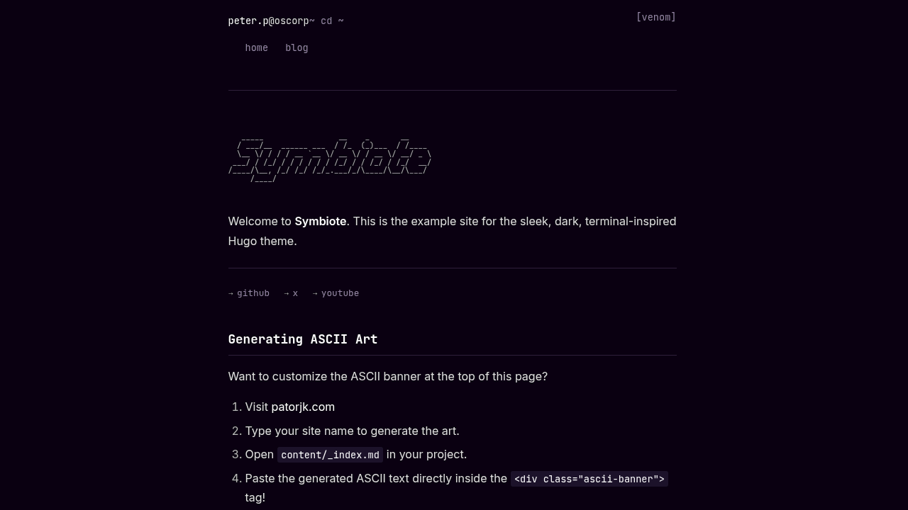
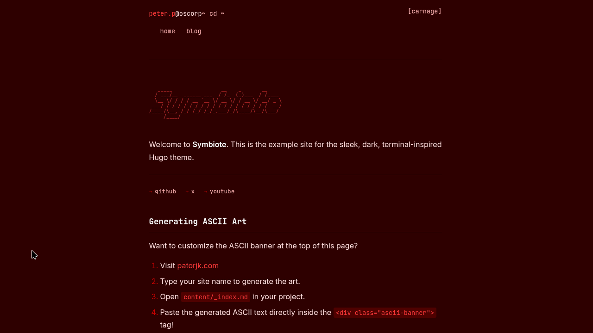
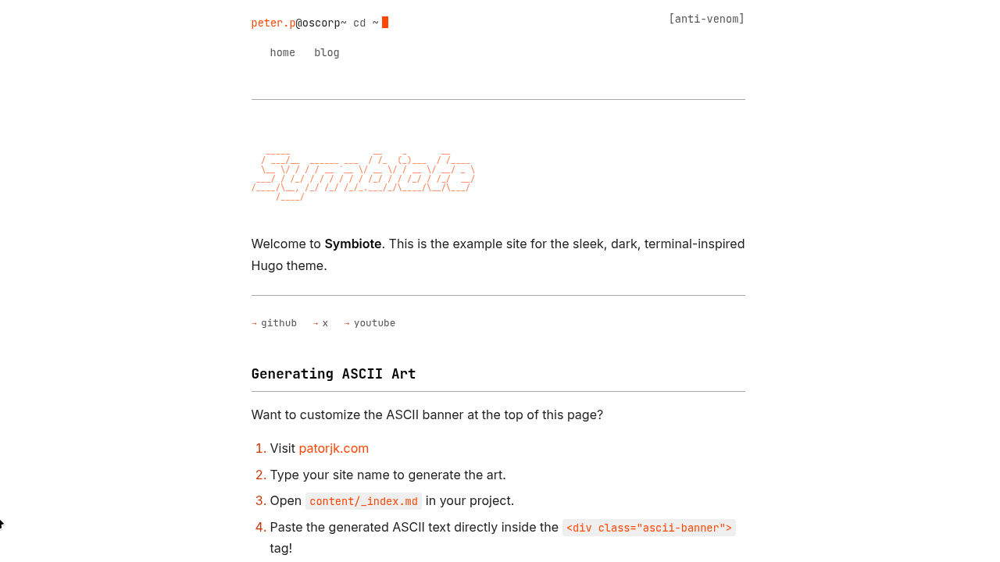
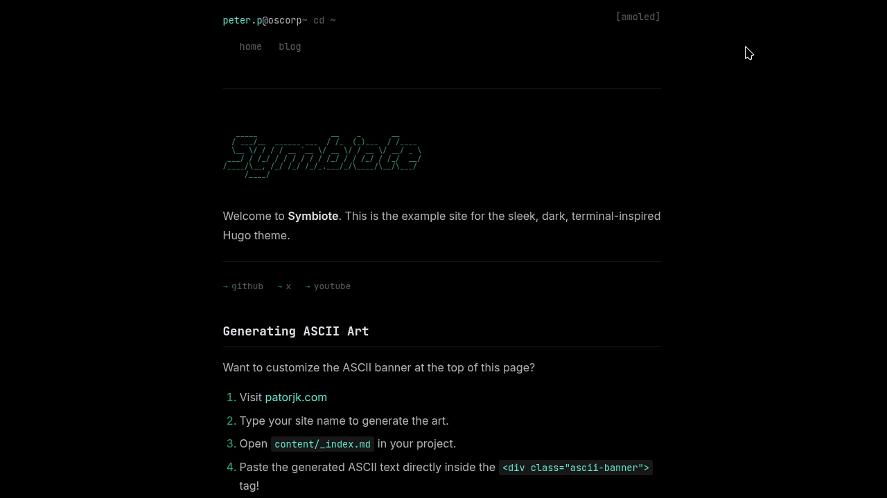

When I set out to build a new portfolio, I couldn't find a Hugo theme that fully resonated with the hacker/security researcher aesthetic without feeling clunky or bloated. I wanted something minimalistic, blazingly fast, and instantly recognizable. I wanted a terminal. 

Thus, **Symbiote** was born. 

## The Spider-Man Inspiration

The name **Symbiote** and its core design philosophy are heavily inspired by the Spider-Man symbiote arc. I wanted the theme to feel sleek, fluid, and a little aggressive—much like the alien suits from the comics. 

Because the theme supports dynamic, instant colour-scheme switching, I named the built-in palettes after famous symbiotes to match their comic-accurate colors:
- **`venom`**: A deep, pitch-black background accented with highly visible white text and aggressive, toxic neon-green accents.

*Inspiration (Art Credit: [frederikhornung on Newgrounds](https://www.newgrounds.com/art/view/frederikhornung/purple-venom))*:

- **`carnage`**: A chaotic, pure red-and-black contrast.

*Inspiration (Credit: [Marvel Database / Fandom](https://marvel.fandom.com/wiki/Cletus_Kasady_(Earth-616)))*:

- **`anti-venom`**: An inverted, bright theme representing the white-and-black suit.

*Inspiration (Credit: [Marvel Database / Fandom](https://marvel.fandom.com/wiki/Anti-Venom_(Symbiote)_(Earth-616)))*:

- **`amoled`**: A specialized ultra-dark variant designed specifically to turn off pixels on OLED screens, maximizing battery life and contrast.

## Engineering Challenges

Building a lightweight theme sounds easy on paper, but keeping the CSS payload tiny while supporting dynamic features required some heavy lifting. 

### 1. The 9-Variable CSS API
To allow users to switch themes instantly without full page reloads, I had to architect a strict **9-Variable CSS API**. Every single element on the page—from the borders to the code syntax highlighting—maps back to these 9 variables (`--bg`, `--text`, `--accent`, etc.). 

This allows the Javascript toggle in the header to instantly swap out the `data-theme` attribute on the root HTML element. The transition is completely seamless, and it hooks into `localStorage` so the browser remembers your favorite suit the next time you visit. 

### 2. The Blinking Terminal
The header features a dynamic typing animation mimicking a terminal prompt (`peter.p@oscorp ~ cd /blog`). One of the primary challenges was ensuring this Javascript animation didn't block page rendering or cause layout shifts. I wrote a custom, lightweight DOM-listener script that parses the current Hugo route and dynamically simulates the exact `cat` or `ls` command you would use in a real Linux terminal to reach that page. 

### 3. Global CSS Bleed
A common issue in Hugo templating is ensuring that layout CSS doesn't accidentally bleed into the parsed Markdown content. Early in development, the global `<header>` rules were hijacking the headers inside article `<article>` blocks. I had to strictly isolate the CSS hierarchy (e.g., using `.container > header` vs `.post-content > header`) to guarantee that user-written markdown never breaks the layout.

## The Result

The final product is a hyper-optimized theme relying on **Hugo Pipes** to fingerprint and minify the CSS. It features full i18n support, a built-in `curl` hint footer for terminal junkies, and a dynamic ASCII art banner. 

If you're a developer or security researcher looking for a fast, no-nonsense theme, check out the [source code on GitHub](https://github.com/br0wnboi/hugo-theme-symbiote). Feel free to fork it, break it, and build your own custom symbiote variant.
